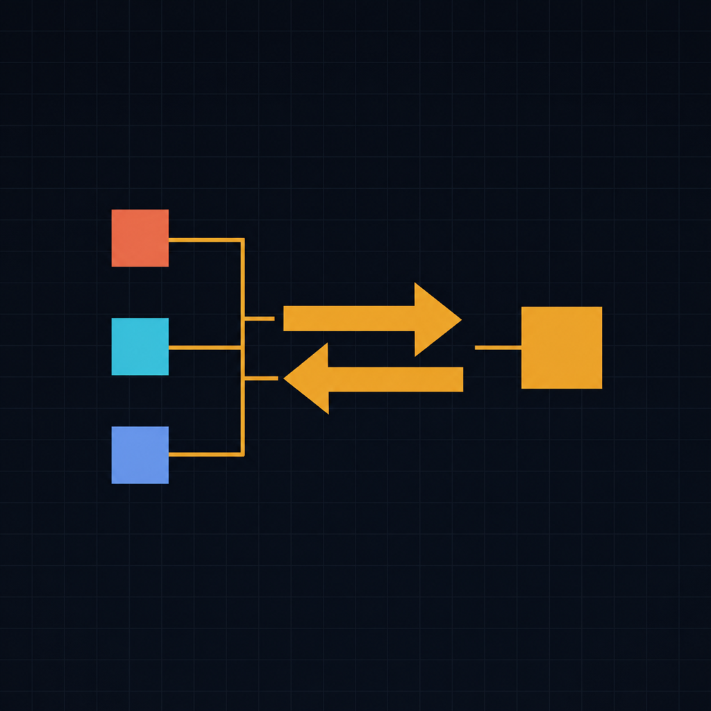
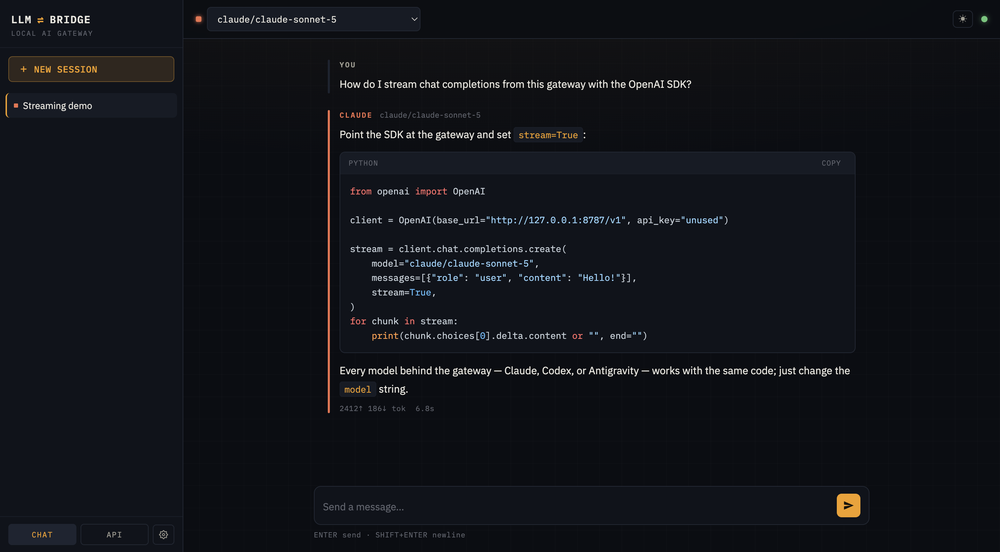
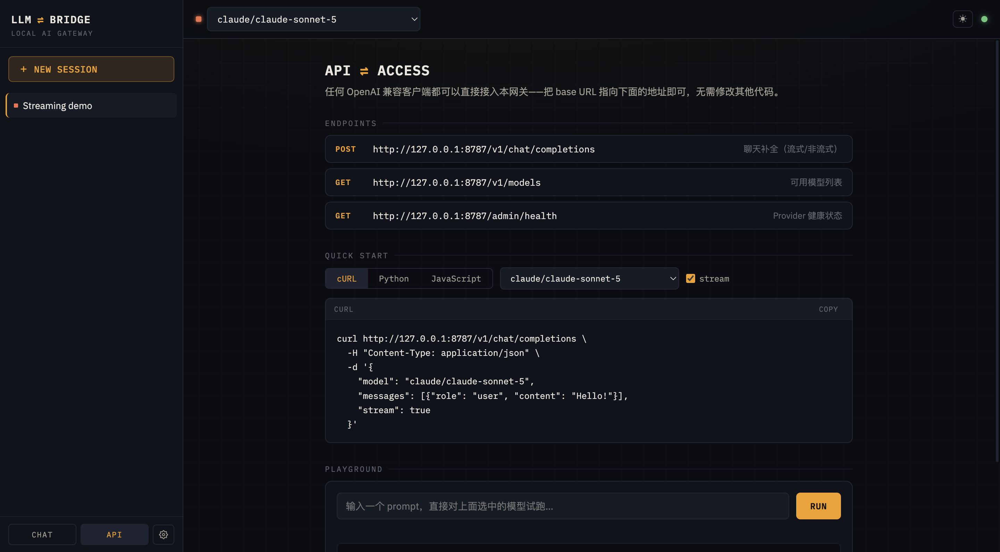

<p align="center">
  
</p>

# LLM ⇌ BRIDGE

**Your AI subscriptions, one API.** A local personal gateway that unifies Claude Code, Codex, and the Antigravity CLI behind a single OpenAI-compatible endpoint — with a built-in chat UI.

[English](README.md) | [简体中文](README.zh-CN.md)




## Why

If you pay for Claude, ChatGPT (Codex), and Google's Antigravity, your quota is scattered across three CLIs with three interfaces. LLM-Bridge puts every model behind **one OpenAI-compatible API** and one chat UI, reusing each tool's own subscription login — no API keys to buy, no tokens to extract.

```python
from openai import OpenAI

client = OpenAI(base_url="http://127.0.0.1:8787/v1", api_key="unused")

for model in ["claude/claude-sonnet-5", "codex/gpt-5.5", "agy/gemini-3.5-flash-medium"]:
    r = client.chat.completions.create(model=model, messages=[{"role": "user", "content": "Hi!"}])
    print(model, "→", r.choices[0].message.content)
```

> **Scope, honestly stated**: chat-only (no tool calling / vision), single-user,
> localhost-first. Everything goes through **official CLI/SDK harnesses** — this
> gateway never extracts or replays OAuth tokens (providers ban that: Anthropic
> added server-side blocks in January 2026 and fully enforced in April 2026).
> Headless Claude usage draws from monthly Agent SDK credits.

## Providers

| Provider | Harness | Models | Model list |
|----------|---------|--------|------------|
| **claude** | claude-agent-sdk (bundles its own CLI) | Fable 5, Opus 4.8, Sonnet 5, Haiku 4.5 | Models API when key set, else static |
| **codex** | `codex exec --json` subprocess | GPT-5.5, GPT-5.4, GPT-5.4-mini, … | dynamic (CLI's own cache) |
| **agy** | `agy -p -` subprocess (Antigravity) | Gemini 3.5/3.1, Claude 4.6 Thinking, GPT-OSS 120B | dynamic (`agy models`) |

## Install

**As a tool** (no clone needed):

```bash
uv tool install git+https://github.com/mahui/llm-bridge
llm-bridge
```

Or grab the wheel from the [latest release](https://github.com/mahui/llm-bridge/releases/latest) and `uv tool install ./llm_bridge-*.whl`.

**From source**:

```bash
git clone https://github.com/mahui/llm-bridge.git && cd llm-bridge
uv sync
uv run llm-bridge
```

Then open **http://127.0.0.1:8787**. Prerequisites: Python 3.12+, [uv](https://github.com/astral-sh/uv), and at least one CLI logged in (`claude`, `codex login`, or `agy`).

> **Intel Mac note**: `cryptography` ≥49 (a transitive dependency) ships no
> x86_64 macOS wheels. llm-bridge ≥0.1.1 pins 48.x on Intel Macs automatically;
> if you see a Rust/OpenSSL build error on 0.1.0, upgrade or reinstall.

## Web UI



- Streaming chat with per-conversation model selection and concurrent conversations
- Provider signal colors — see at a glance which provider answered (rail color per message)
- **API view**: endpoint reference, copy-ready cURL/Python/JS snippets that track your selected model, and an in-page playground
- Settings: API key, default model, global system prompt, reasoning effort
- Light/dark theme (follows system, toggle in topbar)
- Markdown + code highlighting, sanitized with DOMPurify

## API

Any OpenAI-compatible client works — point `base_url` at the gateway:

```bash
curl http://127.0.0.1:8787/v1/chat/completions \
  -H "Content-Type: application/json" \
  -d '{"model": "sonnet", "messages": [{"role": "user", "content": "Hello!"}], "stream": true}'
```

- `GET /v1/models` — all models, `provider/model` format, aliases: `fable` `opus` `sonnet` `haiku` `gemini-pro` `flash`
- `reasoning_effort` (OpenAI-standard) is honored: claude (default `medium`), codex (`-c model_reasoning_effort`); agy encodes depth in model variants (`-low/-medium/-high`)
- `GET /admin/health`, `GET /auth/status` — provider health and login hints
- Swagger docs at `/docs`

## Configuration

User config at `~/.llm-bridge/config.yaml` (packaged defaults ship in the wheel):

```yaml
server:
  host: "127.0.0.1"
  port: 8787
  api_key: ""            # set to require Authorization: Bearer <key>

providers:
  claude:
    enabled: true
    api_key: ""          # optional: dynamic model list via free Models API (never inference)
  codex:
    enabled: true
    ignore_user_config: true   # keep ~/.codex skills out of gateway requests (~20k tokens/request)
  agy:
    enabled: true
    cli_path: "agy"

routing:
  default_model: "claude/claude-sonnet-5"
```

### LAN access (your own devices)

```bash
LLM_BRIDGE_API_KEY=$(openssl rand -hex 24) uv run llm-bridge --host 0.0.0.0
```

Open `http://<your-lan-ip>:8787` from other devices and enter the key in Settings. **Set a key before opening the listener** — otherwise anyone on the network burns your subscription quota. Note: traffic is plain HTTP; keep it inside a trusted network and never port-forward to the internet. Sharing beyond your own devices likely violates your subscription's terms — these are personal accounts.

## Limitations

- **Chat-only.** `tools` and multi-modal content are not supported. Sampling params (`temperature`, `max_tokens`, …) are accepted but not forwarded — CLI harnesses don't expose them.
- CLI subprocess latency: ~3–8s per request (codex/agy). Claude via Agent SDK is similar.
- Concurrency is limited (2 in-flight requests per provider); this is a personal gateway, not a serving stack.
- agy output is plain text: chunk-level streaming, no token accounting.

## Development

```bash
uv sync
uv run llm-bridge --debug
uv run ruff check src scripts
uv run python scripts/test_providers.py     # smoke tests (needs a running server + logged-in CLIs)
```

See [CONTRIBUTING.md](CONTRIBUTING.md) for architecture invariants (subprocess lifecycle rules, the compliance line) and [CLAUDE.md](CLAUDE.md) for AI-assistant development context.

## License

[MIT](LICENSE)
